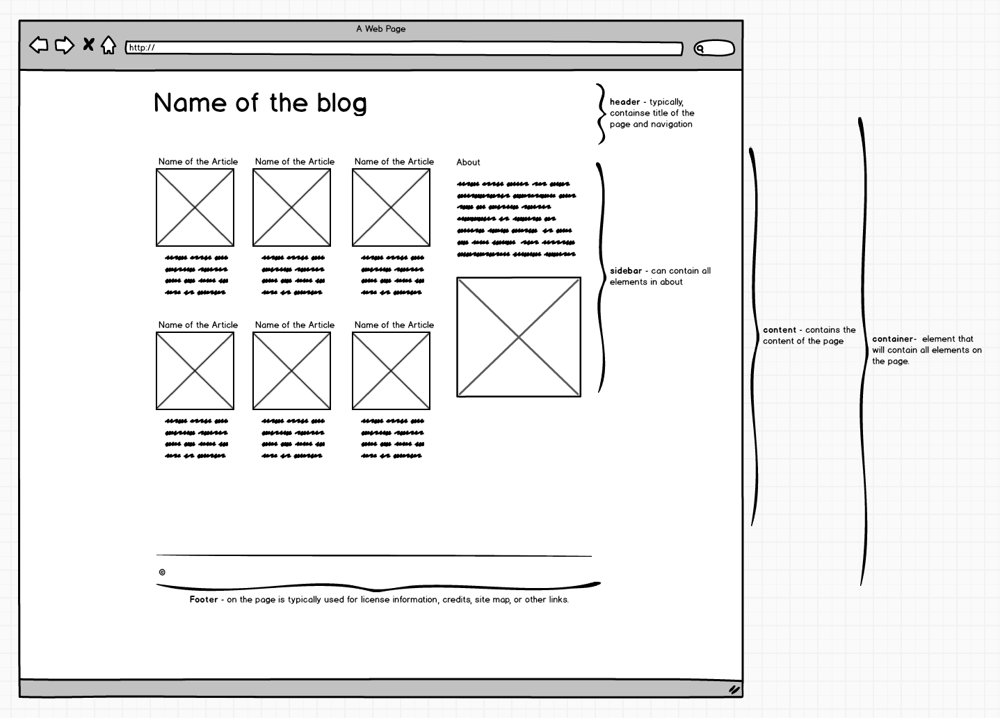

# HTML/CSS Project

## For Day 1

Create a new webpage on a subject that you're interested in. The page should **NOT** use any framework like Bootstrap and it should include the following elements:
  - The `.html` page and a linked `.css` file applies a consistent color scheme to links and text on your page.
  - A page header with a title and description for the site.e.
  - Proper use of the semantic HTML tags.
  - Use proper class names
  - An articles section with three articles, each including a title, summary and a link.
  - A page footer containing info about you or the sit
  - Use the sketch below to guide you towards the layout and content you are trying to achieve. *Please note that this is just a sketch - you can choose the colours, fonts and images that you want to use in the page.*

  
  
## For Day 2

Revisit the webpage you created in yesterday's homework assignment.
  - Add proper positioning for your elements in your page. Make it look clean with proper margins and paddings. Put proper emphasis on more important items
  - Make your site responsive to common mobile, tablet and desktop breakpoints

## For Day 3
Revisit the webpage you created in yesterday's homework assignment.
  - Add a sidebar to your site and move the site description into it. This should appear below the articles on small screens, then switch to a two-column layout with the articles and sidebar sitting side-by-side, using CSS Grid.
  - Add at least three more articles and then convert them to a grid, so that you show 3 articles per row in a box layout using CSS Flexbox.

  
  

## For Day 4
  - Use a framework to implement the same site
